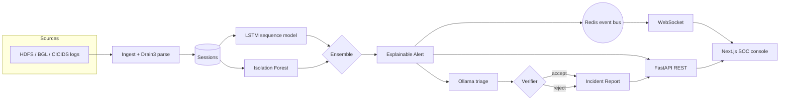

<div align="center">

# 🛡️ NexGuard

### AI-Powered Security Operations Platform

**_Detect Faster. Investigate Smarter. Respond with Confidence._**

[](.github/workflows/ci.yml)
[](backend/pyproject.toml)
[](frontend/package.json)
[](#license)
&nbsp;·&nbsp; **178 tests** &nbsp;·&nbsp; `mypy --strict` clean &nbsp;·&nbsp; local-first, privacy-preserving

</div>

---

NexGuard is a local-first Security Operations platform that helps SOC analysts cut
through alert fatigue. It pairs a **layered anomaly-detection stack** (a DeepLog-style
LSTM + Isolation Forest + a calibrated ensemble) with **explainable-by-construction
alerts**, a **locally-hosted LLM triage copilot** that drafts analyst-ready incident
reports, and a **hallucination-verification gate** that refuses to let the copilot
fabricate evidence. Nothing leaves your infrastructure — the LLM is a local Ollama
model, never a cloud API.

> **Status — v0.1.0, all four phases complete.** Layered detection with model
> comparison + calibration + MLflow, verified LLM triage, the analyst feedback loop,
> all 8 console pages, Prometheus/Grafana observability, a security-hardening pass,
> the full test matrix (incl. Playwright e2e), and one-command deploy. See the
> [roadmap](#-roadmap), [`CHANGELOG.md`](CHANGELOG.md), and
> [`docs/architecture/build-plan.md`](docs/architecture/build-plan.md).

## ✨ Highlights

- **Two complementary detectors + ensemble.** DeepLog-style next-event prediction
  (PyTorch LSTM) for *ordering* anomalies, Isolation Forest for *compositional*
  anomalies, combined by a calibrated weighted ensemble with severity banding.
- **Explainable alerts.** Every alert carries structured evidence: predicted-vs-actual
  event, confidence, perplexity, the suspicious subsequence, and the top statistical
  drivers (via model-agnostic occlusion attribution).
- **Verified AI triage.** A local LLM drafts a Pydantic-structured incident report;
  a **verifier rejects any report** that cites a host, timestamp, event, or component
  not present in the real evidence. MITRE ATT&CK techniques are structurally pinned
  to **"Hypothesis"**, never asserted as fact.
- **Real-time console.** A premium dark-theme Next.js SOC dashboard streams new
  alerts live over WebSocket, with an incident-report drawer.
- **Production-grade spine.** Clean Architecture, JWT auth + RBAC + audit logging,
  rate limiting, security headers, RFC-9457 errors, structured logging, Prometheus
  metrics, Alembic migrations, Docker Compose, and CI.

## 🖥️ The Console

A restrained, data-dense dark theme in the spirit of CrowdStrike Falcon and Microsoft
Sentinel. Run the stack and open **http://localhost:3000**:

| Page | What it shows |
|------|---------------|
| **Executive Dashboard** | Active/critical alerts, avg anomaly score, live CPU/memory; a **live alert feed** (WebSocket), severity donut, model/system health |
| **Alert Explorer** | Search + severity/status filters, investigation workflow (label alerts), report drawer |
| **Incident Reports** | AI-drafted, verified (or rejected) reports — evidence, timeline, affected components, MITRE hypotheses, investigation/containment steps |
| **Log Explorer** | Parsed sessions + their event sequences, and the mined Drain3 templates |
| **Detection Analytics** | Alert distribution, anomaly-score spectrum, admin threshold tuning, latest recalibration impact |
| **Live Monitoring** | Streaming CPU/RAM/RSS + active alerts (`/ws/metrics`), live resource chart, event stream |
| **Feedback Center** | Analyst verdict distribution, recalibration history, before/after precision/recall |
| **Configuration** | Admin-editable detection operating point (weights/threshold), model + system info |

Sign in via a split-panel enterprise login (JWT); demo credentials are one click away.

<!-- Screenshots: capture from the running console at http://localhost:3000 and drop
     PNGs under docs/screenshots/ (login.png, dashboard.png, report-drawer.png). -->

## 🏗️ Architecture

Clean Architecture / Ports & Adapters — the domain and use cases never import a
framework; every external concern (PyTorch, Ollama, SQLAlchemy, Redis) is an adapter
behind a port. Full detail in [`docs/architecture/`](docs/architecture/README.md).



**Layers (backend):** `domain` (entities, value objects, ports) ← `application`
(use cases) ← `infrastructure` (adapters) + `interfaces` (FastAPI/WS/CLI + composition
root). See [ADRs](docs/architecture/adr) for the *why* behind each key decision.

## 🚀 Quickstart

### Option A — Docker Compose (full stack, one command)

```bash
docker compose -f docker/docker-compose.yml up --build
```

This starts PostgreSQL + Redis, runs migrations, **trains the detectors and seeds
alerts from the bundled HDFS fixture**, serves the API on `:8000`, and the console on
`:3000`. Sign in with a demo account shown on the login screen (e.g.
`analyst@nexguard.local` / `NexGuardAnalyst!23`). For real LLM reports, add
`--profile ollama` and set `NEXGUARD_LLM_PROVIDER=ollama`.

### Option B — Local dev

```bash
# Backend (Python 3.12, uv)
cd backend
uv sync
uv run nexguard seed        # ingest → train → detect → create demo users (SQLite)
uv run nexguard serve       # API + WS on http://localhost:8000  (docs at /docs)

# Frontend (Node 22)
cd ../frontend
cp env.example .env.local
npm install && npm run dev  # console on http://localhost:3000
```

## 📊 Detection results

On the bundled, deterministic HDFS fixture (60 normal + 10 anomalous blocks), the
seeded pipeline achieves — pinned by a **regression test**
([`tests/regression`](backend/tests/regression)):

| Model | Precision | Recall | F1 | ROC-AUC | FPR |
|-------|-----------|--------|----|---------|-----|
| LSTM (DeepLog) | 1.00 | 1.00 | 1.00 | 1.00 | 0.00 |
| Transformer | 1.00 | 1.00 | 1.00 | 1.00 | 0.00 |
| Isolation Forest | 0.14 | 1.00 | 0.25 | 0.50 | 1.00 |
| **Ensemble** | **1.00** | **1.00** | **1.00** | **1.00** | **0.00** |

Full methodology, operational metrics (latency/throughput/alerts-per-10k),
calibration, and an **honest reading** of why Isolation Forest is near-random on
this fixture (its anomalies are *new templates*, which favor the sequence models)
are in **[`docs/benchmarks.md`](docs/benchmarks.md)**. Reproduce with
`cd backend && uv run python ../ml/evaluate.py --calibrate`.

> Why HDFS: its logs are naturally session-partitioned by `block_id` with block-level
> ground-truth labels — exactly the shape a sequence model needs. The BGL and CICIDS
> adapters prove the pipeline generalizes to time-windowed logs and network flows.

## 🧪 Testing

```bash
cd backend  && uv run pytest -q          # 166 backend tests (unit/integration/api/regression)
cd frontend && npm run test              # 12 component/unit tests
cd frontend && npm run e2e               # Playwright e2e (needs a seeded stack; CI-gated)
```

Coverage spans domain logic, every adapter (real SQLite/Drain3/PyTorch/sklearn),
the API surface (auth, RBAC, WebSocket, feedback, analytics, config), the
hallucination verifier, the evaluation harness + calibration, and a seeded
end-to-end anomaly regression test.

## 📁 Project structure

```
NexGuard/
├── backend/         nexguard package (domain · application · infrastructure · interfaces) + FastAPI
├── frontend/        Next.js 15 SOC console (App Router, Tailwind v4, TanStack Query)
├── docker/          Dockerfiles + docker-compose stack
├── scripts/         HDFS sample generator, data helpers
├── docs/            architecture, ADRs, design spec, build plan
└── .github/         CI (ruff · mypy · pytest · vitest · image builds)
```

## 🔐 Security

Treated as an enterprise application from the first slice: Argon2id password hashing,
short-lived access JWTs + refresh rotation, RBAC (`admin`/`analyst`/`viewer`),
append-only audit logging, per-identity rate limiting, security headers (CSP, HSTS,
X-Frame-Options), Pydantic input validation, and env-injected secrets (nothing
sensitive is committed). See [ADR-0006](docs/architecture/adr/0006-security-model.md).

## ⚠️ Limitations & honest caveats

- Detection results above are on the **bundled deterministic HDFS fixture** (60+10
  blocks) — a controlled slice, not a claim of field accuracy. Full-dataset
  methodology and an honest reading of Isolation Forest's near-random showing are in
  [`docs/benchmarks.md`](docs/benchmarks.md).
- **Ollama is optional**; without it a deterministic stub provider keeps the pipeline
  and CI fully functional (real triage reports need a local model).
- Rate limiting is **per-process** (in-memory); a multi-instance deployment should
  back it with Redis. Playwright e2e runs in **CI** (needs a live seeded stack +
  browser), not as part of the plain unit run.
- Screenshots below are placeholders until captured from a running console —
  everything they'd show is reproducible with `docker compose up`.

## 🗺️ Roadmap

| Phase | Scope |
|-------|-------|
| **1 — Vertical slice** ✅ | End-to-end path: ingest → parse → detect → explain → alert → verified report → API/WS → live dashboard |
| **2 — Detection & MLOps** ✅ | Transformer variant, evaluation harness + metrics, model comparison, MLflow, threshold calibration, BGL/CICIDS adapters, benchmarks |
| **3 — Full platform** ✅ | All 8 console pages, analyst feedback loop + recalibration, streaming metrics |
| **4 — Hardening & delivery** ✅ | Refresh-token rotation + CSP/security headers + threat model, Prometheus/Grafana, full test matrix + Playwright e2e, one-command deploy (Vercel + Render), release polish |

## 🚢 Deploy

- **Local / demo:** `docker compose -f docker/docker-compose.yml up --build` (add
  `--profile observability` for Prometheus + Grafana).
- **Cloud:** frontend → **Vercel**, backend + Postgres + Redis → **Render** via the
  one-click [`render.yaml`](render.yaml) blueprint.

Full walkthrough — env vars, migrations, seeding, and free-tier caveats — in
**[`docs/DEPLOYMENT.md`](docs/DEPLOYMENT.md)**.

## License

Apache-2.0.
